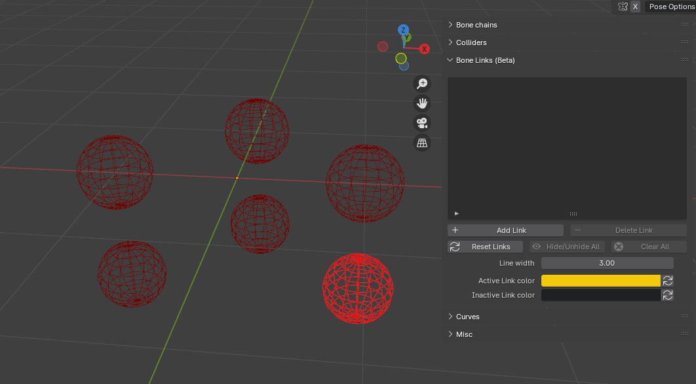
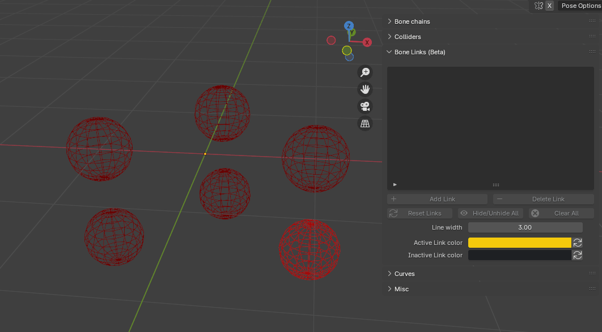
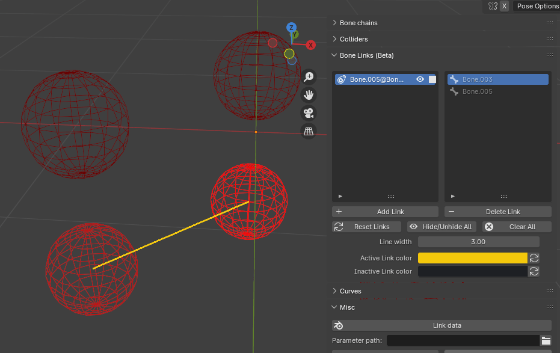

Bone links are a feature introduced in version 1.7.0 that enables users to define links between bones from different bone chains. It is designed to maintain the distance between them and help prevent the underlying meshes from deforming unnaturally.

!!! warning

    **This feature is still under development, your feedback is very welcome!**

<video width="800" height="480" controls>
  <source src="../../Resources/Vids/1_7_0/bonelink.mp4" type="video/mp4">
</video>

The requirements to add a link between bones are the following:

* They must be from different bone chains.
* One of the bones cannot be a root bone (a root bone is the first parent of a bone chain).

If these requirements are all met, bone links can be created by either:

* Selecting two bones and adding the link.

<figure markdown>
  { width="700" }
</figure>

* Selecting three bones and adding the links: a link will be created between the **active** bone and the other two.

<figure markdown>
  { width="700" }
</figure>

If everything worked fine, the link will be displayed in the viewport. You can change its color, change its line width and hide it.

<figure markdown>
  { width="700" }
</figure>

You can **deactivate** a chain link by clicking on the corresponding icon in the list. It will temporarily disable it, making it easier to compare different setups. If a link is inactive, it will be displayed in a different color, which can also be customized.

<figure markdown>
  { width="700" }
</figure>