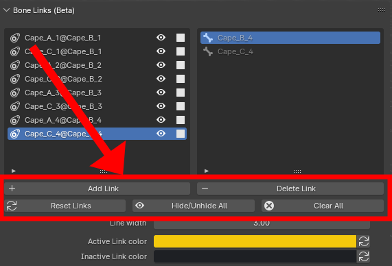

The operators can be found below the link list.

<figure markdown>
  
</figure>

## Add Link

Create one or several link(s). Refer to [Getting started](./basics.md) for more details.

## Delete Link

Delete the link currently selected in the link list.

## Reset Links

Reset all the links' default length, use it if you edit one of the bone's rest pose.

<figure markdown>
  { width="700" }
</figure>

## Hide/Unhide All

Hide/Unhide all the links.

## Clear All 

Delete all the links.

