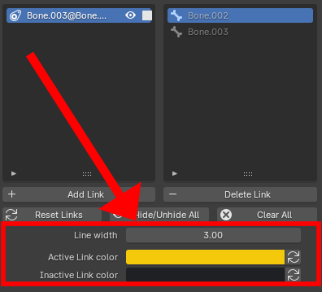

The bone link parameters can be found below the operators.

<figure markdown>
  
</figure>

## Line width

The width of the links' display in the 3D viewport. 

## Active Link Color

The active links' color in the 3D viewport.

## Inactive Link Color

The inactive links' color in the 3D viewport.