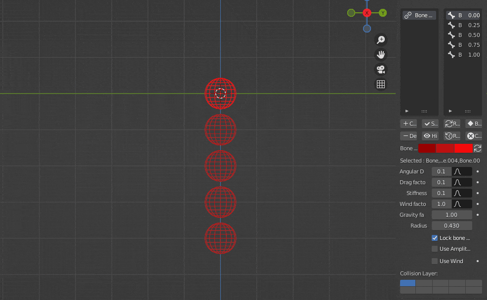
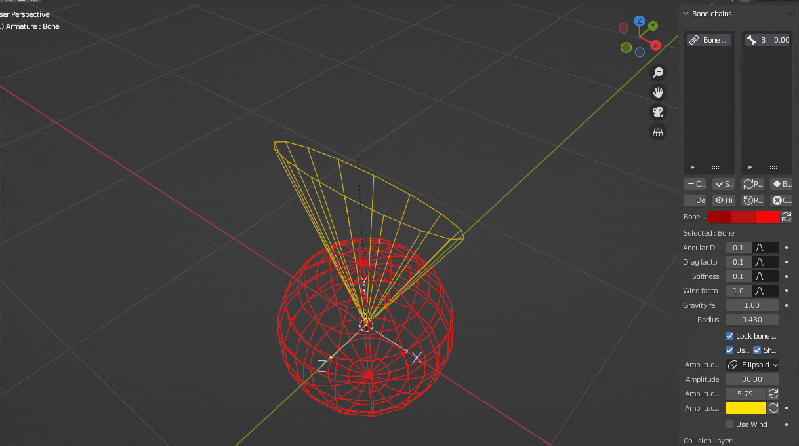

The amplitude feature allows you to restrict the maximum rotation of a bone. It can be very useful to constrain the overall chain movement to a specific area.

To use this feature, click on "Use Amplitude". It will enable it for all the currently selected bones.

<figure markdown>
  
</figure>

There are currently two constraint types available : Conic and Ellipsoidal. They offer different profiles to have better control on the simulated motion and avoid undesired behaviors. The bone's rotation will stay constrained into the area represented by these shapes.

<figure markdown>
  
</figure>

!!! info

    The original orientation of the constrained area will be based on the bone's rest pose (the one in Edit Mode). If it's changed after the activation, disable then re-enable the amplitude constraint to update it. The below examples show how to change an ellipsoid constraint orientation by changing the bone roll (CTRL-R) and the rest pose orientation.

    <figure markdown>
      
    </figure>

    The ellipsoid's axes are the bones' X and Z axes. Displaying the bone axes for the armature can help getting the desired orientation.

    <figure markdown>
      
    </figure>

# Parameters

## Show Amplitude

Hide/unhide the selected bones' amplitude shape.

## Amplitude type

Use this parameter to switch between the two constraint types.

## Amplitude

* For the conic constraint, It defines the maximum bone rotation angle from its rest pose Y axis, in any direction.
* For the ellipsoidal constraint, It defines the maximum bone rotation angle from its rest pose Y axis, along its rest pose X axis (which is used as one of the ellipsoid semiaxis).

Due to representation considerations, the amplitude goes from 0 to 90 degrees for conic constraints and from 5 to 70 degrees for ellipsoidal ones.

## Amplitude 2

Only available for the ellipsoidal constraint. It defines the maximum bone rotation angle from its rest pose Y axis, along its rest pose Z axis (which is used as one of the ellipsoid's semiaxis).
Use the button on the right to reset it to the Amplitude's value. It is also limited to the [5; 70] range.

## Amplitude color

Use this option to change the amplitude's shape color. A reset button to put it back to its original value is also available on the right of the color value.