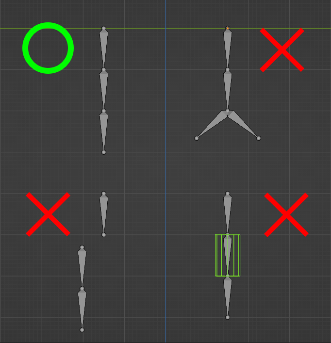
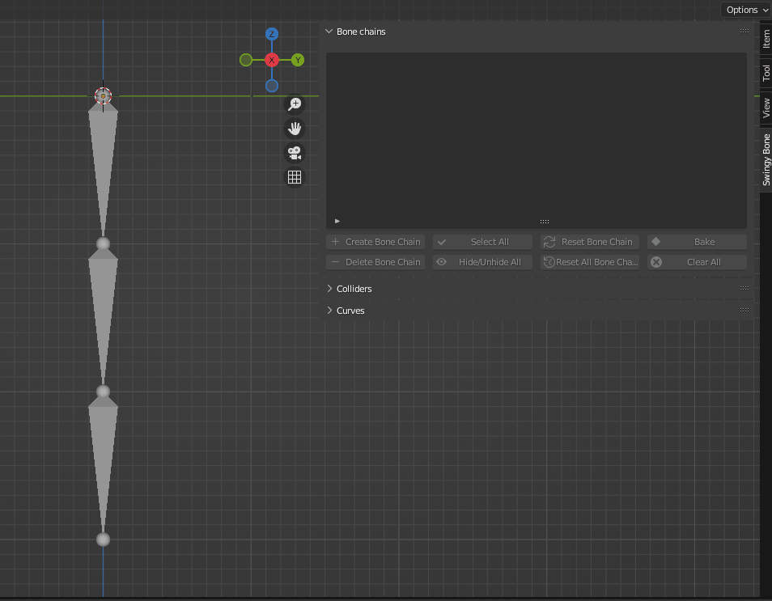
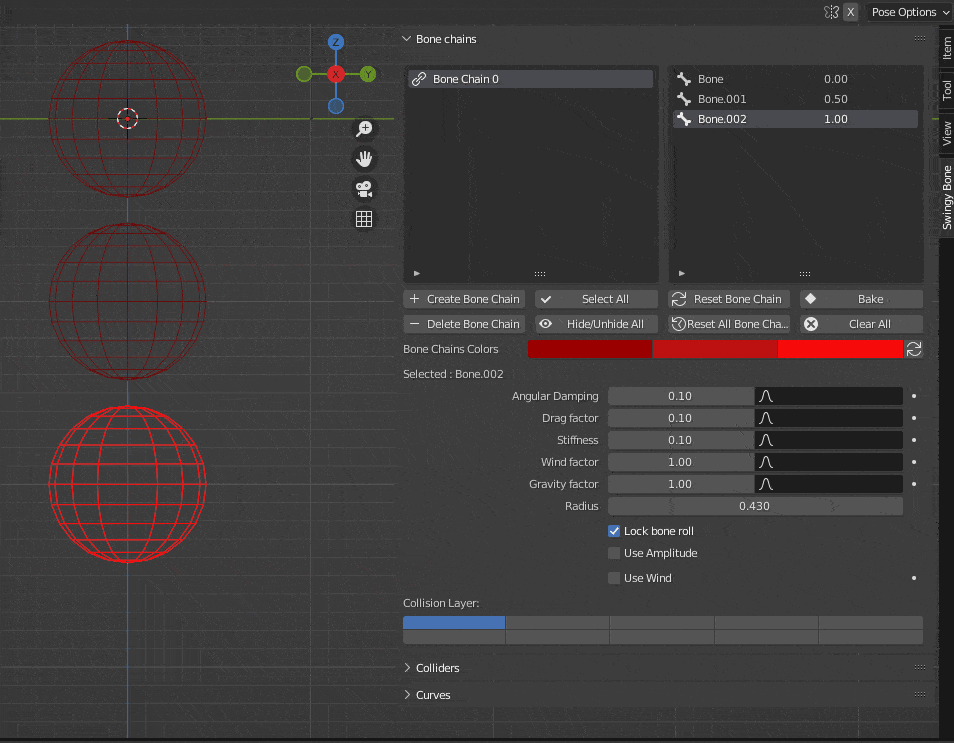

A Bone Chain is a succession of connected bones that will be simulated using the addon's solver and the parameters set by the user.

!!! warning

    **After you created a bone chain, do not rename its bones as it will break references. If you want to do so, delete the chain first, rename the bones then recreate it.**

The requirements for the bones that will be part of a chain are the following:

* They must be connected.
* They must not be part of another chain.
* They must not have a [collider](../collider/basics.md) attached.
* They must not have more than one child.

<figure markdown>
  
</figure>

If these requirements are all met, a bone chain can be created by following these steps:

* Select the armature that has the bones you want to simulate.
* Switch to Pose Mode.
* Select the top parent of the future chain and click on "Create Bone Chain".

!!! warning

    **If some bones present in the chains have some keyframes, the latter will be deleted. You will be asked to confirm if you really want to proceed.**

If everything worked fine, the bones' shapes should have changed to spheres, representing their collision radius. Otherwise, an error message will be displayed, showing what went wrong.

<figure markdown>
  
</figure>

Once created, the bone chain will be added to the chain list and its bones will be displayed on the right. The color scheme used for these can also be changed using the "Bone Chains Colors" parameter as shown below. You can also rename the chain in the list to something more intuitive. For more information about the physics parameters located below, please refer to the [parameters](parameters.md) section.

<figure markdown>
  
</figure>

