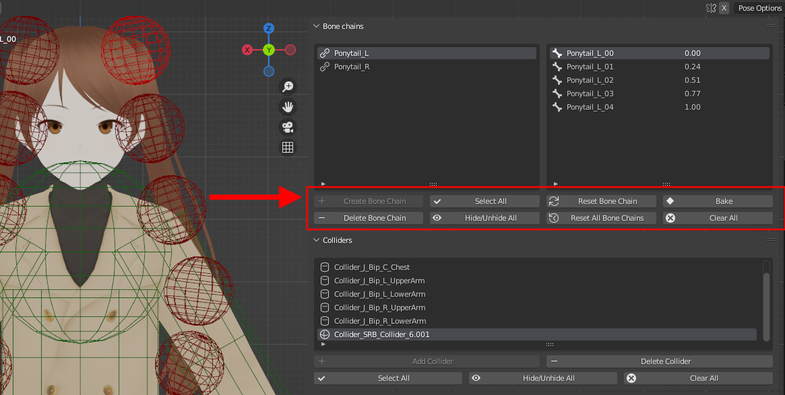

The operators can be found below the bone chain list. 

<figure markdown>
  
</figure>

## Create Bone Chain

Create a bone chain. Refer to [Getting started](./basics.md) for more details.

## Select All

Select all the bones from all the bone chains in the viewport.

## Delete Bone Chain

Delete the bone chain currently selected in the bone chain list.

## Clear All 

Delete all the bone chains.

## Reset Bone Chain

Reset the bone chain to its original (before simulation) state. It is recommend to use this operator instead of the default Alt-G/Alt-R shortcuts as it will reset parameters like the velocity.

## Reset All Bone Chains

Same as the above, for all the bone chains.

## Hide/Unhide All

Hide/Unhide all the bone chains and associated amplitude shapes.

## Bake

Bake the simulation to keyframes (using the viewport's playback range). 
If the playback mode is set to "frame dropping", the simulation will be played fully and the keyframes will be recorded to match the viewport view accordingly.
