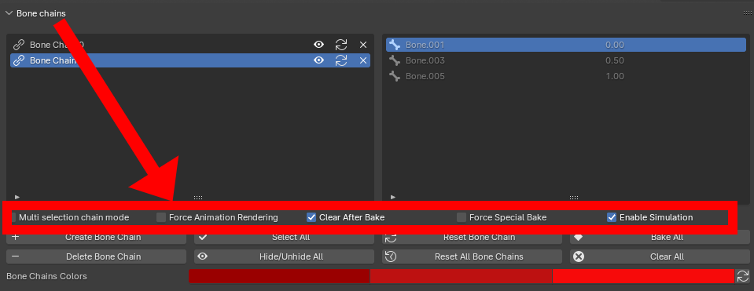

The options can be found below the bone chain list.

<figure markdown>
  
</figure>

## Multi Selection Chain Mode

Allows creating a bone chain from a given selection. This can be used to create a chain of arbitrary length.

## Force Anim Rendering

Makes the animation play when manually moving through the timeline, making it possible to render the animation directly.

## Clear After Bake

Makes it possible not to remove the bone chains after baking the animation

!!! warning

    **Don't forget to temporarily disable the simulation if you want to preview the result after baking if the chains weren't cleared. If not, the keyframes will interact with the simulation in a innacurate way.**

## Force Special Bake

Uses the addon's own baking operator instead of Blender's default. 

## Enable Simulation

Enable/Disable the simulation
