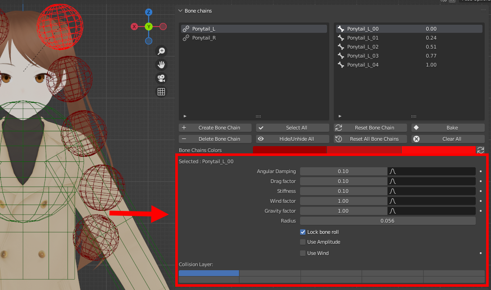
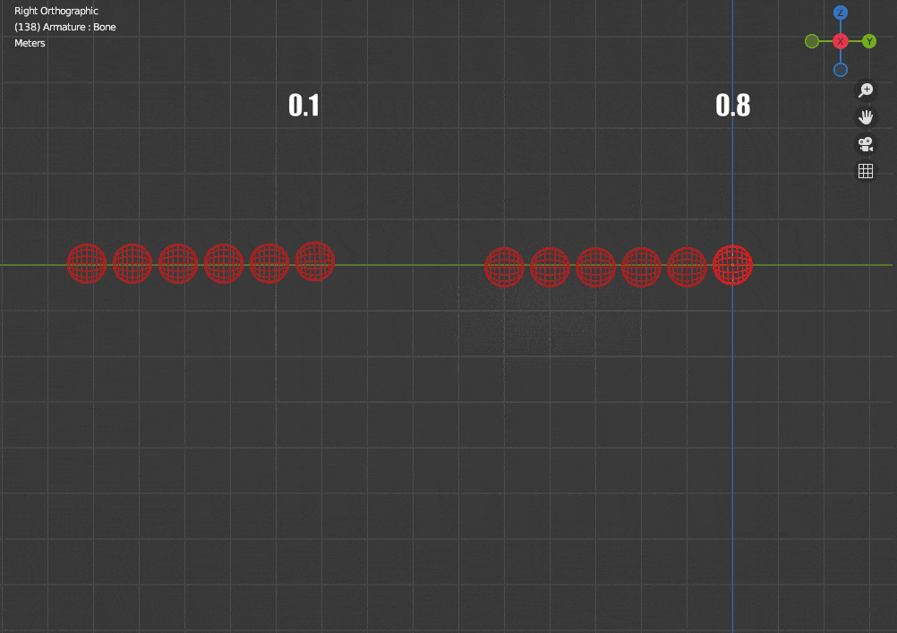
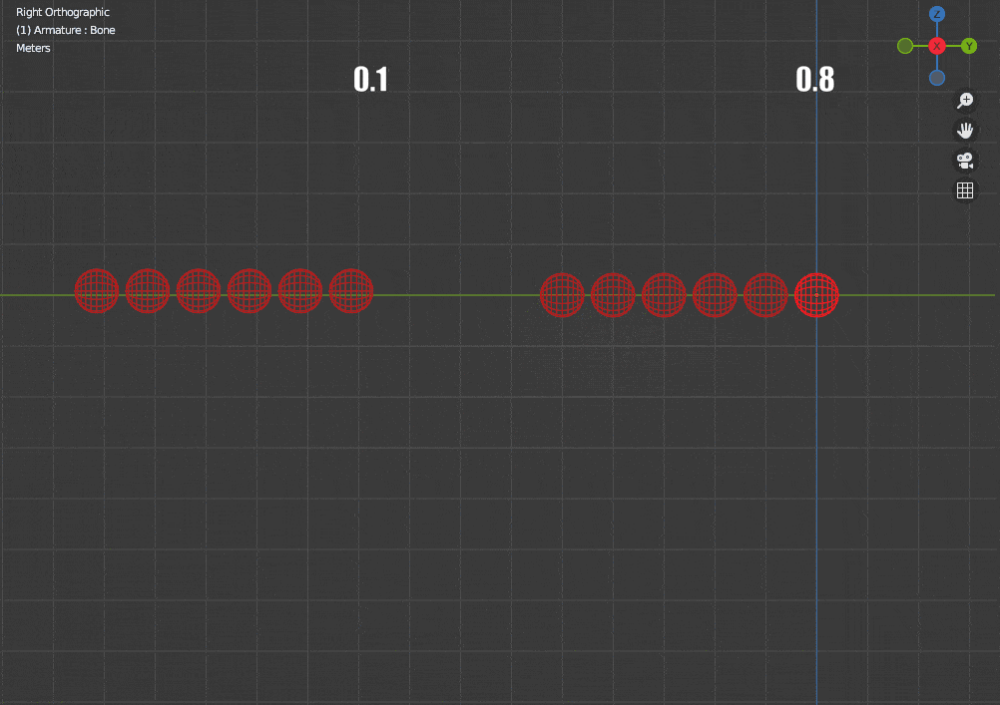
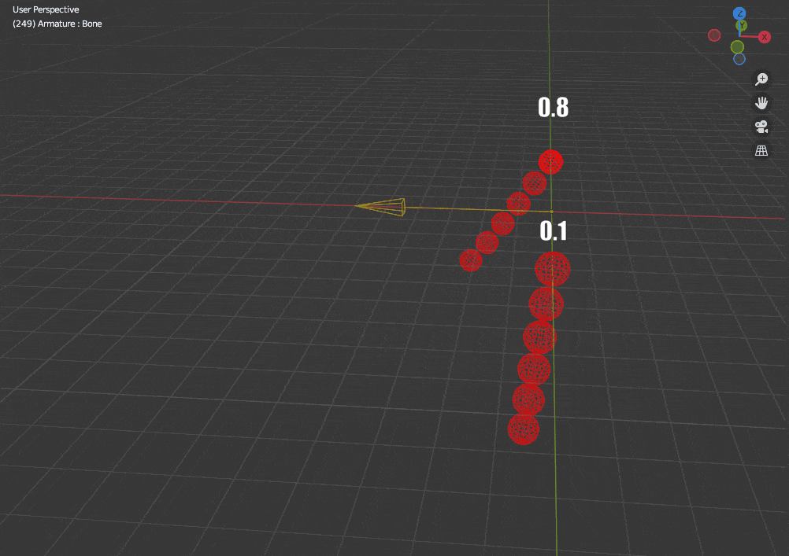
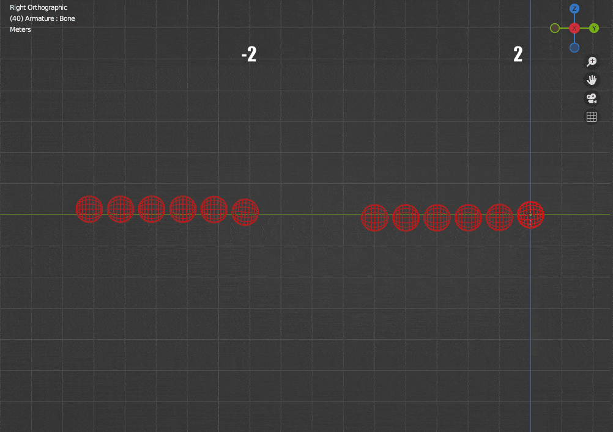

The physics parameters can be found below the bone chain operators, when a simulated bone is selected.

<figure markdown>
  
</figure>

!!! info

    **If you edit a value, it will be applied to all the selected bones. This makes it very easy to set several bones' parameters to the same value at once.**

## Angular damping

The amount of angular velocity lost during movement. Between 0 (none) and 1 (full loss).

<figure markdown>
  {width="500"}
</figure>

## Drag Factor

The amount of opposition to movement when translated. Between 0 (none) and 1 (full opposition).

<figure markdown>
  {width="500"}
</figure>

## Stiffness

The amount of pre-simulation pose to preserve. Between 0 (fully simulated) and 1 (not simulated).

<figure markdown>
  {width="500"}
</figure>

## Wind Factor

Wind influence factor. Between 0 (none) and 1 (full influence).

<figure markdown>
  {width="500"}
</figure>

## Gravity Factor

The gravity influence factor. It can be negative to have bones "falling" in the opposite direction, which can be helpful to make floaty chains when combined with amplitude limits for example.

<figure markdown>
  {width="500"}
</figure>

## Radius

The bone's collision radius.

## Lock Bone Roll

Prevents rotation along the local Y axis. It can be very helpful to preserve the overall shape of the mesh rigged to the simulated chain. It is recommend to leave it activated.

## Use Amplitude

Enable the amplitude constraint for this bone. Refer to the [amplitude section](./amplitude.md) for more info.

## Use Wind

Enable the wind for the whole armature. Refer to the [wind section](./wind.md) for more info.

## Collision Layer

The collision layer this bone belongs to. The bone will only collide with colliders who share it.