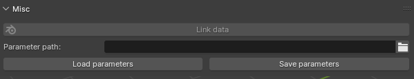
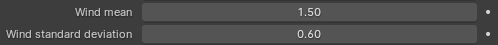
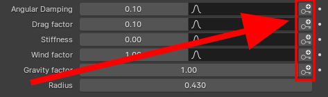
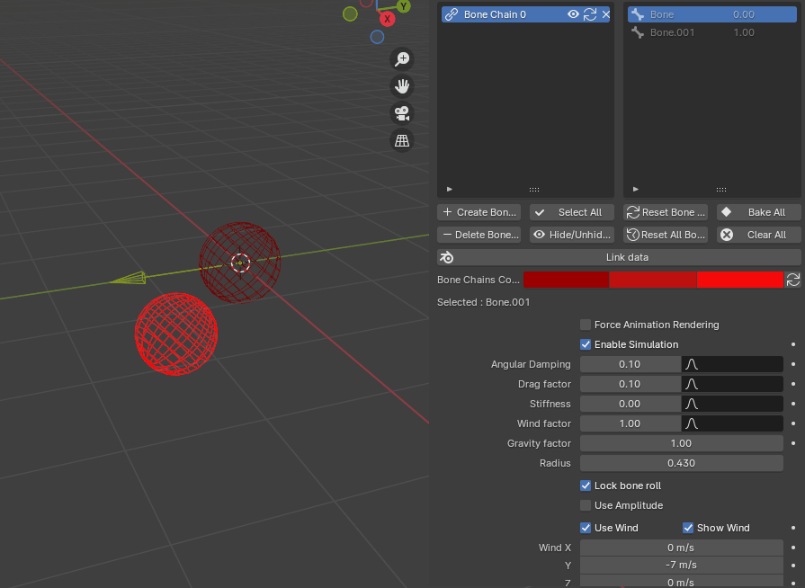
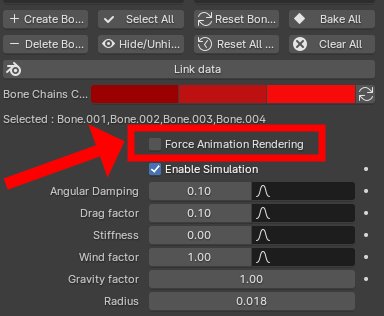
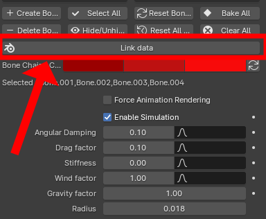
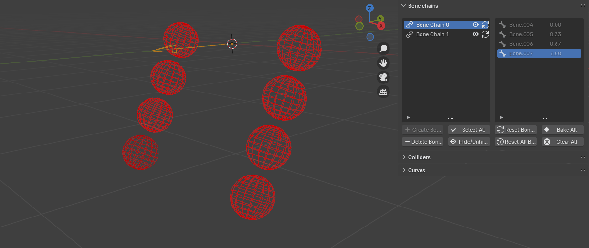
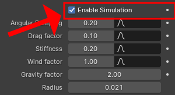

## Version 1.6.0

### Update instructions

* The update instructions are the same as the [version 1.2.0 instructions](#update-instructions_5).

### Changes

* Fixed a bug related to the extra child's rotation.

* Multi bone selection has been added for the bone chain creation. The requirements are the same but the last bone can have more than one child.

<video controls>
  <source src="../Resources/Vids/1_6_0/multiSelect.mp4" type="video/mp4">
</video>

* A new parameter save feature has been added. Bone parameters can now be saved and imported back.

<figure markdown>
  { width="400" }
</figure>

* Wind parameters have been exposed to the user for easier fine-tuning.

<figure markdown>
  { width="400" }
</figure>

* A collision axe feature has been added to only move on the spherical collider's specific axe when colliding. 

<video controls>
  <source src="../Resources/Vids/1_6_0/colliderAxes.mp4" type="video/mp4">
</video>

* A new operator has been added to keyframe parameters for a selection of bones.

<figure markdown>
  { width="400" }
</figure>

* The interface has been reworked a little.

## Version 1.5.0

### Update instructions

* The update instructions are the same as the [version 1.2.0 instructions](#update-instructions_5).

### Changes

* Fixed a bug that made collider parameters change at the same time when selected in the collider menu.

* A new bake option has been added: if the playback mode is set to frame drop, the simulation will be played in the viewport and the keyframes recorded accordingly.

* A new "add extra child" feature to control the last bone's rotation has been added. It will be deleted automatically when the chain is deleted/baked.

<figure markdown>
  
</figure>

## Version 1.4.0

### Update instructions

* The update instructions are the same as the [version 1.2.0 instructions](#update-instructions_5).

### Changes

* Fixed a bug giving wrong results when baking the simulation in a scene with several view layers.

* An option to force the animation to play when rendering has been added. When enabled, it will allow the simulation to happen when scrubbing through the timeline.

<figure markdown>
  { width="400" }
</figure>

* A new operator has been added to allow linking/appending assets with swingy bone chains from different .blend files, check out [here](linking.md) for more information.

<figure markdown>
  { width="400" }
</figure>

## Version 1.3.0

### Update instructions

* The update instructions are the same as the [version 1.2.0 instructions](#update-instructions_5).

### Changes

* New icon to hide individual chains more easily

<figure markdown>
  { width="800" }_
</figure>

* New icon to prevent specific chains from resetting when using the Reset All operator

<figure markdown>
  { width="800" }_
</figure>

* Better stiffness implementation: a force will now be applied to preserve the pre-simulation shape of the chain, not the one from the previous frame.

<video controls>
  <source src="../Resources/Vids/1_3_0/StiffnessFixed.mp4" type="video/mp4">
</video>

* Support for projects with multiple view layers has been added.

* The Reset All operator is now available in Object Mode too.

## Version 1.2.1

### Update instructions

* The update instructions are the same as the [version 1.2.0 instructions](#update-instructions_5).

### Changes

* A new option to enable or disable the simulation for a given armature has been added.

<figure markdown>
  { width="400" }
</figure>

## Version 1.2

### Update instructions

* If you used a previous version, first install the new one by following the [updating instructions](./setup.md/#update).
* After that, if you were on **version 1.0** before, you will have to **clear any collider or chain that you previously created using the "Clear All" operators** and recreate them. **Do not use any other operator before doing this or it may lead to some issues!**

### Changes

* Support for Blender 4.0 has been added! 

* Several bug fixes that happened when baking the chains' movement to keyframes.

## Version 1.1

### Update instructions

* If you used a previous version, first install the new one by following the [updating instructions](./setup.md/#update).
* Once that's done, you will have to **clear any collider or chain that you previously created using the "Clear All" operators** and recreate them. **Do not use any other operator before doing this or it may lead to some issues!**

<video controls>
  <source src="../Resources/Vids/V11Clear.mp4" type="video/mp4">
</video>

### Changes

* The armatures' movements in Object Mode will now contribute to the chains' simulation. Both pose mode and object mode transformations will be taken into account now.

* Multiple armature collision support. The chains will now collide with any collider, whether or not they're part of the same armature.

<figure markdown>
  { width="400" }
</figure>

* Better operators version to take multiple armatures into account.

* Added a link to the wiki in the addon tab in the preferences menu

## Version 1.0

### Changes

* Initial release

