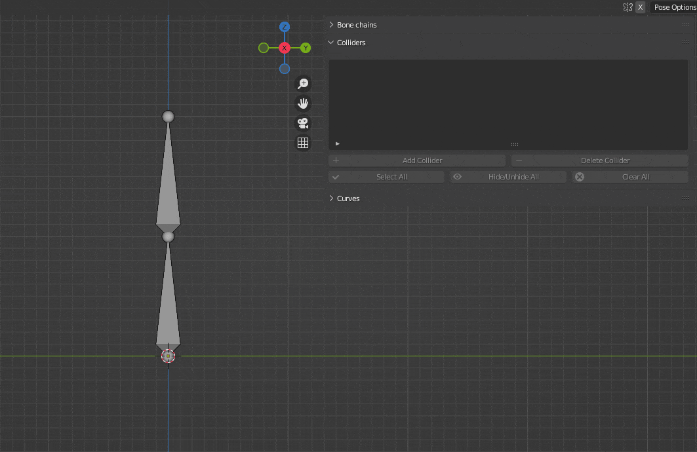
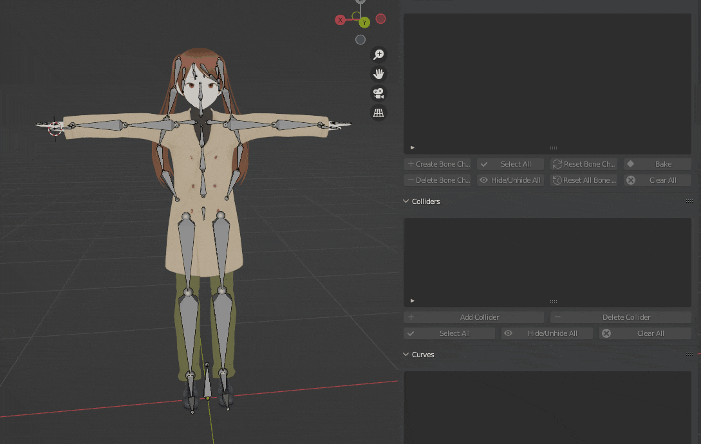

Colliders are simple volumes, attached to bones, that collide with the bone chains.

<video width="800" height="480" controls>
  <source src="../../Resources/Vids/vid2.mp4" type="video/mp4">
</video>

!!! warning

    **After you created a collider, do not rename its current parent as it will break references. Change to another parent, rename it and set it back if you want to do so.**

The requirements to add a collider to a bone are the following:

* It must not be a collider itself.
* It must not be in a bone chain.

If these requirements are all met, a collider can simply be created by following these steps:

* Select the armature that has the bones you want to add colliders to.
* Switch to Pose Mode.
* Select the bones you want to add colliders to, click on "Add Collider", then choose the colliders' shape and confirm.

<figure markdown>
  { width="800" }
</figure>

If everything worked fine, the colliders will be added in the viewport, with a default scale based on their parents. Otherwise, an error message will be displayed, showing what went wrong. 

Once created, the colliders will be added to the collider list. You can freely offset them from their parent bone. Their color scheme can also be changed using the "Colliders Colors" parameter.

<figure markdown>
  { width="800" }
</figure>