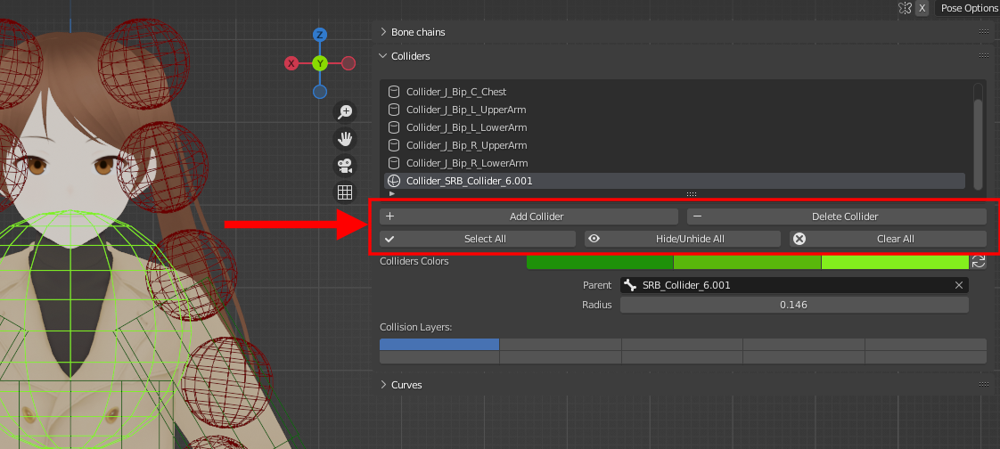

The operators can be found below the collider list.

<figure markdown>
  
</figure>

## Add Collider

Create one or several collider(s). Refer to [Getting started](./basics.md) for more details.

## Select All

Select all the colliders in the viewport.

## Delete Collider

Delete collider currently selected in the collider list.

## Clear All 

Delete all the colliders.

## Hide/Unhide All

Hide/Unhide all the colliders.
