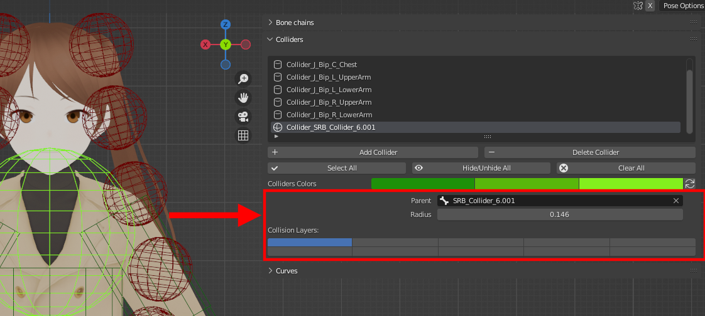

The collider parameters can be found below the operators, when a collider is selected.

<figure markdown>
  
</figure>

## Parent 

The bone this collider is attached to. 

## Collision Layers

The layers of collision this collider belongs to. The collider will only collide with bones who share at least one layer with it.

## Radius

The collider's collision radius.

## Depth 

The collider's collision depth (exclusive to the cylinder shape).