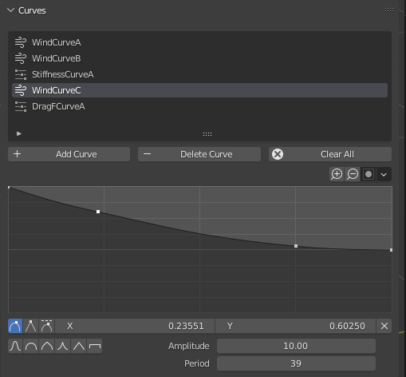

## Overview

The curve editor enables you to create curves in order to fine-tune physics parameters and wind behavior faster and in a more intuitive way.

<figure markdown>
  
</figure>

There are two different curve types: [parameter curves](./parameter.md) (for physics parameters) and [wind curves](./wind.md). When adding a new curve in the editor, you'll be prompted to choose its type.

To better understand the different Curve Widget controls, please refer to [the official Blender documentation](https://docs.blender.org/manual/en/latest/interface/controls/templates/curve.html).

## Operators

### Add Curve

Create a new curve, which will be added to the curve list.

### Delete Curve

Delete the curve that is currently selected in the curve list.

### Clear All

Delete all the curves.

