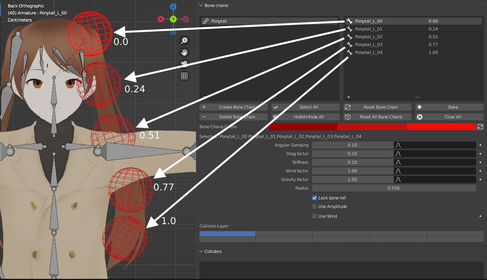
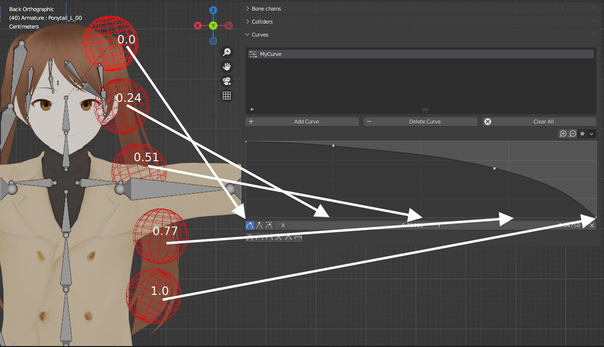
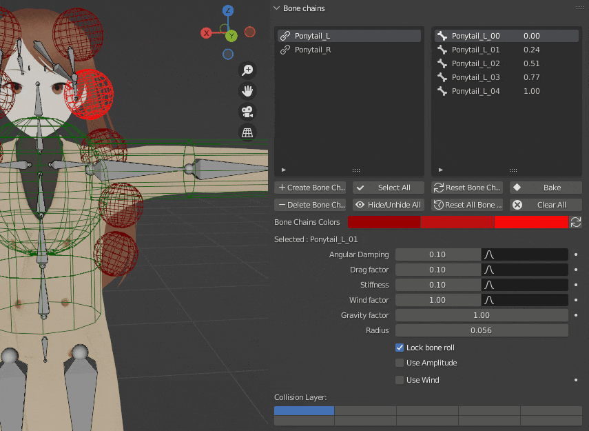

## Overview

These curves allow you to define a profile which will be used by the different bones in a chain to set their physics parameters. It can be faster than setting different values for every bone manually if you want to try different distributions.

After creating a bone chain, a decimal value next to each bone will be added. This value represents at what percentage of the total chain length this bone is located, from 0 (first bone, origin) to 1 (last bone, total length). 

<figure markdown>
  { width="800" }
</figure>

When sampling the curve to get the final parameter value for the bone, this percentage will be used as the X value.

<figure markdown>
  { width="800" }
</figure>

## Using the curves

Once you have created a curve, you can have a bone use it for a given parameter by putting it in the corresponding field (it will override the fixed value on the left).

!!! info

    **Make sure to select the whole chain (using the chain list for example) if you want to set a curve for all its bones directly, as shown below.**

<figure markdown>
  
</figure>

