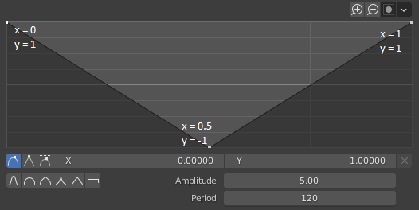
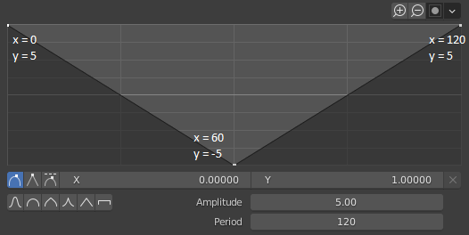
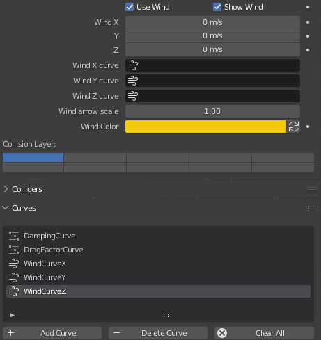

## Overview

These curves allow you to define a profile to make the wind intensity variable instead of fixed. Each wind vector component (x,y,z) can have its own custom curve.

A wind curve has two more parameters than the parameter curve: Amplitude and Period. The amplitude is used to define the highest and lowest value on the Y axis while the period will determine the length in frames that the full curve is equivalent to.

For example, consider the curve below:

<figure markdown>
  
</figure>

It has 3 points, an amplitude of 5 and a period of 120 frames. The "real" values for the 3 points are the following:

* X = 0 * 120 = 0 /
  Y = 1 * 5 = 5
* X = 0.5 * 120 = 60 /
  Y = -1 * 5 = -5
* X = 1 * 120 = 120 /
  Y = 1 * 5 = 5

<figure markdown>
  
</figure>

The value is first set at 5, decreases until it reaches -5 and goes back to 5. All of this in 120 frames, as defined by the period. If we had set a period of 60 frames, it would have taken half the time to do the exact same. 

Once the end of the curve is reached, it loops back to the beginning, so if we have a total viewport playback of 240 frames, the above curve will be used twice. The video below showcases this at 24fps, the curve being used on the Wind's X component. We can see the velocity varying between -5 and 5 just as expected.

<video width="800" height="480" controls>
  <source src="../../Resources/Vids/vid0.mp4" type="video/mp4">
</video>

## Using the curves

Once you have created a curve, you can have the wind components use it by setting it in the corresponding fields. The fixed values above will be overriden accordingly.

<figure markdown>
  
</figure>

