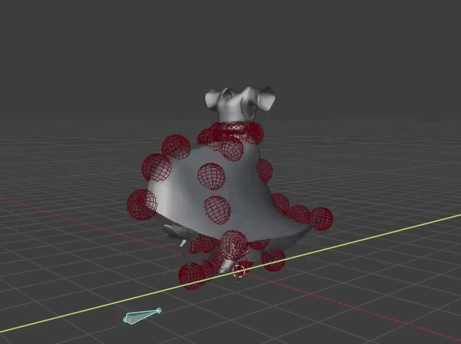
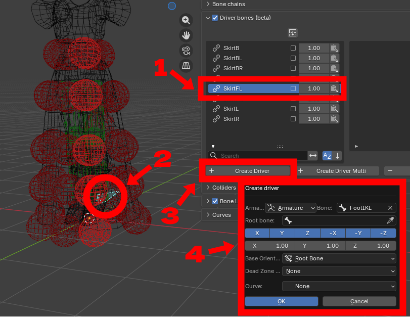
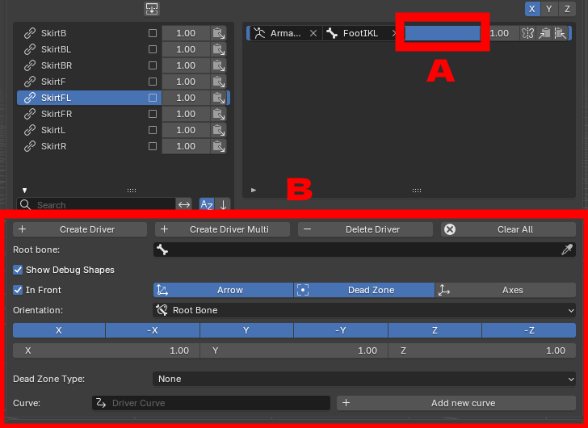
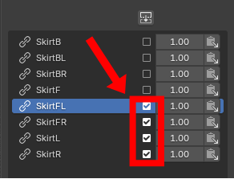

Driver bones are a feature introduced in version 2.0 that enables users to give an impulse to bone chains by using another bone's movement. It can be very helpful to help against clipping.

<figure markdown>
  { width="700" }
</figure>

!!! warning

    **This feature is still under development, your feedback is very welcome!**

You can create a driver by following these simple steps:

* 1: Under the driver tab, select the bone chain that the driver is going to influence

* 2 (optional): select the driver bone. It is also possible to set it manually in the "create driver panel" so this step can be skipped

* 3: Click on "create driver"

* 4: Set the parameters (you can also set them later) and click OK

<figure markdown>
  
</figure>

The driver will be added to the driver list of the chain. You can display its [parameters](./parameters.md) by selecting it (A) and then modify them below (B)

<figure markdown>
  
</figure>

!!! note

    You can add the same driver to several chains by ticking their associated box and choose "Create Driver Multi" instead of "Create Driver"

    <figure markdown>
        
    </figure>

Moving the driver bone will then give an impulse to its associated bone chain. The behaviour can be fine-tuned using the differents [parameters](./parameters.md).
