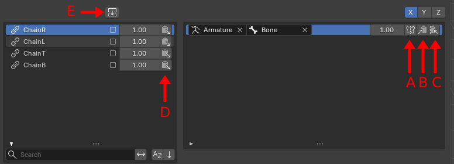
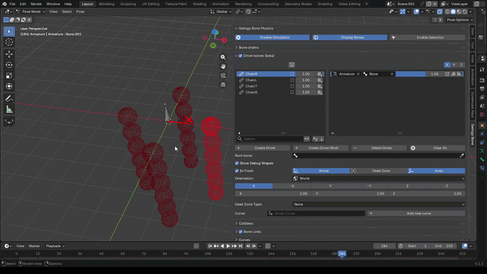
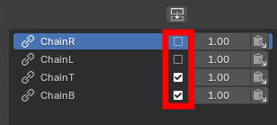
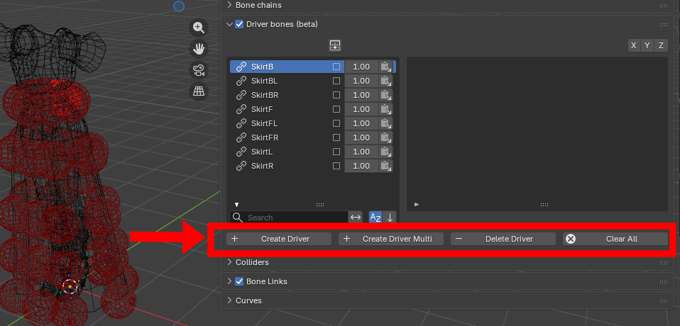
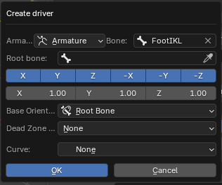
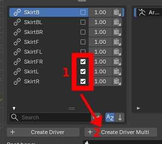

## List operators

These operators can be found in the bone chain and driver lists, under the driver tab:

<figure markdown>
  
</figure>

### Mirror (A)

Mirror the drivers' axes, based on the selected components
<figure markdown>
  
</figure>

### Copy (B)

Copy the driver

### Mirror Copy (C)

Copy the mirrored driver

### Paste (D)

Paste the driver

### Multi Paste (E)

Paste the driver to all the selected bone chains

<figure markdown>
  
</figure>

## Tab operators

These operators can be found below the bone chain and driver lists. 

<figure markdown>
  
</figure>

### Create Driver

Create a new driver for the bone chain. The different [parameters](./parameters.md) can be set directly.

<figure markdown>
  
</figure>

### Create Driver Multi

Create a new driver for all the selected bone chains

<figure markdown>
  
</figure>

### Delete Driver

Delete the currently selected driver

### Clear All

Delete all the bone chain's drivers