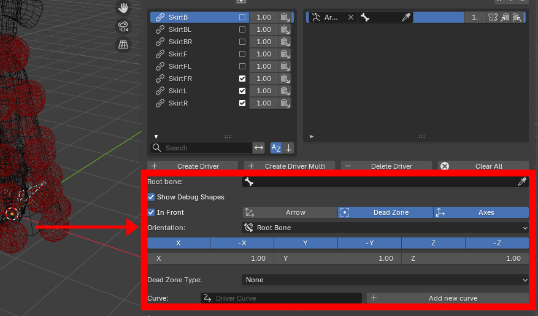
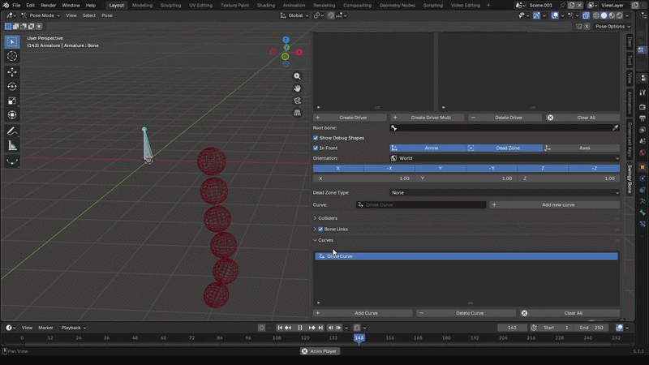

The driver parameters can be found below the operators.

<figure markdown>
  
</figure>

## Root Bone

The bone relative to which the driver's movement is measured. 

## Show Debug Shapes

Hide/Unhide the debug helpers

## In Front

Show some of the debug helpers in front of other scene elements

## Debug Components

Hide/Unhide the different debug helpers individually (arrow/dead zone/ axes)

## Orientation

Choose the axes orientation between world/armature/root bone/local spaces

## Axes

Driver axes taken into account by the bone chain's movement

## Axes factors

The amount of influence per axis to the total driver contribution

## Dead Zone Type

Set a spherical/box dead zone, in which the driver's movement will be ignored.

<figure markdown>
  
</figure>

## Curve

Set a curve that is used to determine the driver's influence across the bone chain.
