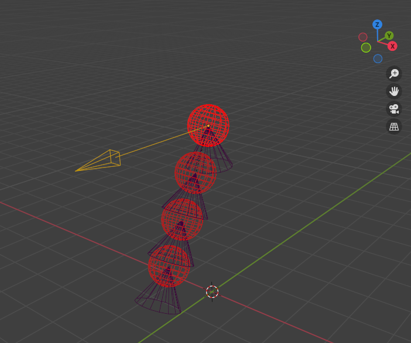
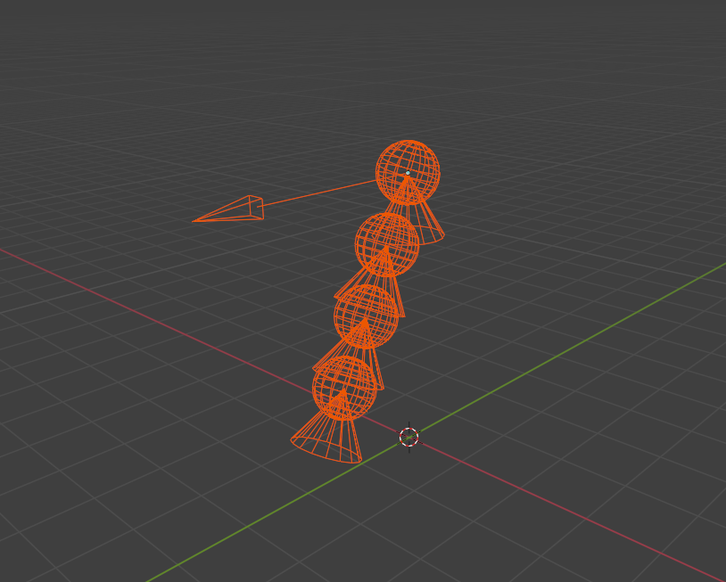
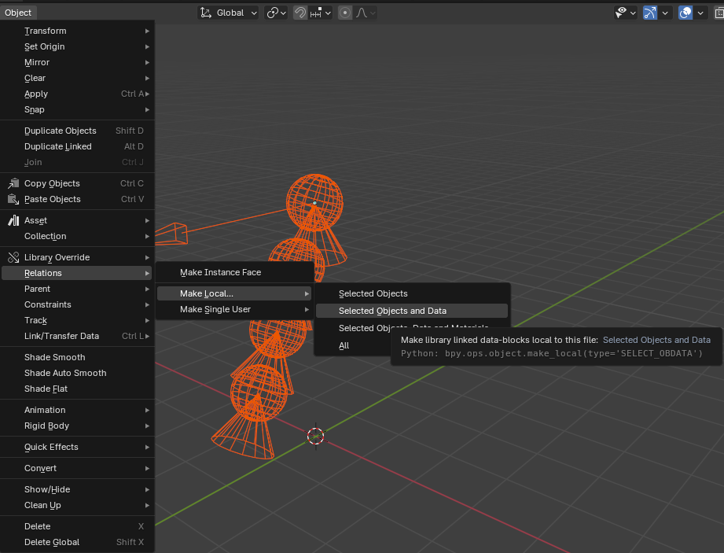

In this tutorial, you will learn how to link/append an asset with bone chains from another .blend file.

## Setup

- We will link this bone chain to a new blend file:

<figure markdown>
  { width="400" }
</figure>

- First open a new scene then link or append it by first going to File->Link/File->Append then selecting your blend file and finally getting the armature that has the chain(s) in the **"object"** folder.

<figure markdown>
  { width="400" }
</figure>

- You will then need to make the asset local, to do so select it and go to **Object->Relations->Make Local->Select Objects and Data**

<figure markdown>
  { width="400" }
</figure>

- Finally, fill the bone chains tab by clicking on "Link Data" while in **pose mode** and select the .blend file you got the asset from.

<figure markdown>
  { width="400" }
</figure>

- That's it!