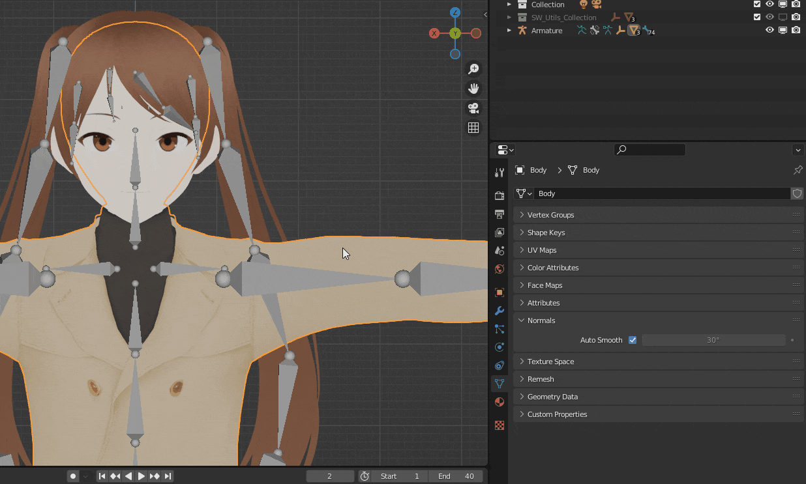
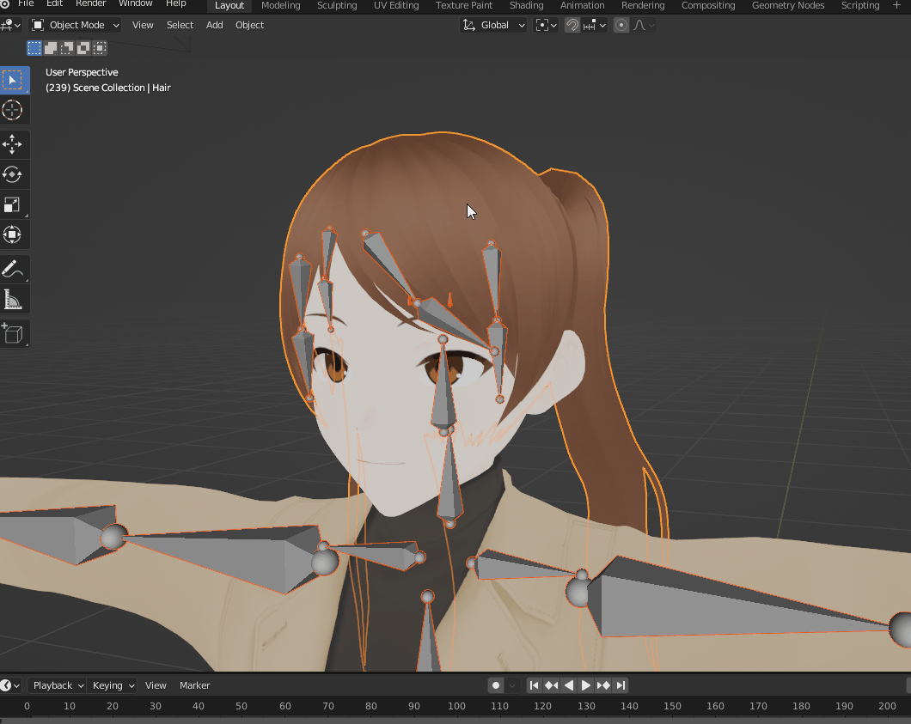
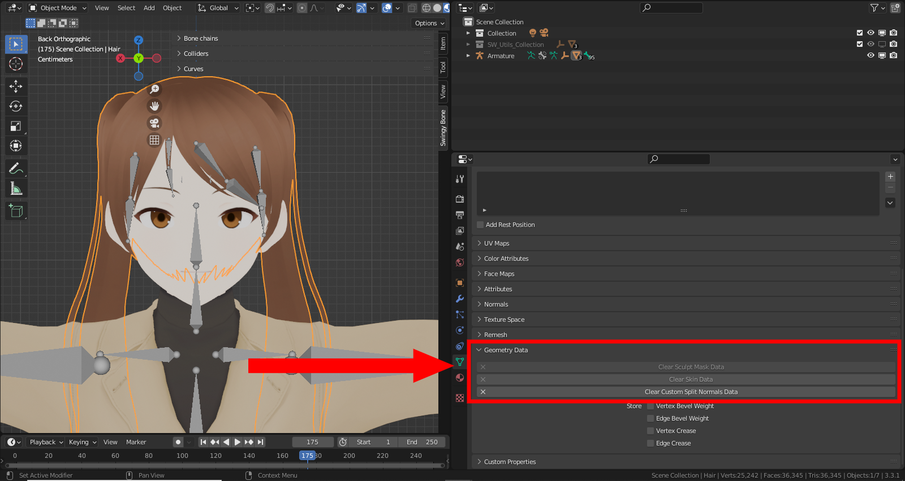
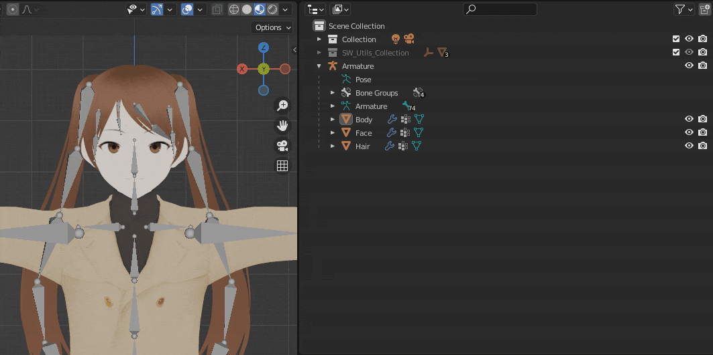
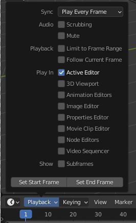

When working with complex models, the extra simulation computation may make the viewport less responsive. The following tips can be used to improve the playback FPS.

## General tips

- All general tips to improve the playback FPS apply here, check out this list for some examples: [https://blender.stackexchange.com/a/14241](https://blender.stackexchange.com/a/14241)
- Try to keep your rig clean and optimized (no unnecessary bones, constraints, drivers etc).
- If necessary, make proxy meshes (with lower resolution, simpler modifier stack etc) for very high poly meshes.

You can also try the below tips, which can result in a very notable performance increase depending on your assets.

### Disable Autosmooth

Disabling autosmooth for the meshes can have a notable impact on the performance. You can find it under "Object Data Properties -> Normals -> Autosmooth". You can disable it for several meshes at once by selecting them then disabling it for the active mesh while holding the ALT key.

<figure markdown>
  { width="800" }
</figure>

### Clean model weights

Sometimes when transferring weights or using auto skinning solutions, you can end up with too many bones influencing some vertices with a negligible weight, which can be very inneficient during computation. You can remove these unnecessary contributions by using the built-in Blender cleaning tool with a low minimum threshold (0.001 for example).

<figure markdown>
  { width="800" }
</figure>

### Remove Custom Split Normals Data

Imported meshes from external file formats often have custom normals data, unless absolutely necessary it's best to remove them to improve the computation speed.

<figure markdown>
  
</figure>

### Disable Meshes

Hiding meshes you don't need (with the H key or the eye icon in the outliner) doesn't stop Blender from taking them into account when animating. What you want instead is disabling them, using the outliner's icons.

<figure markdown>
  { width="800" }
</figure>

### Playback options

When enabling playback, several editors are taken into account by default. You may limit the computation to a single editor by going under the playback options and choosing "Active Editor".

<figure markdown>
  
</figure>