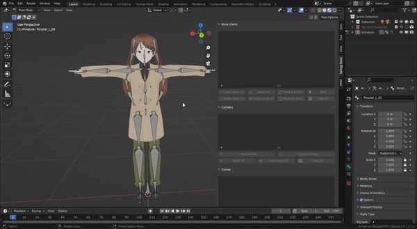
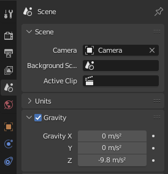

The addon's workflow is pretty straighforward:

- Create some bone chains and adjust their parameters/constraints (see the [bone chain section ](./bone-chain/basics.md) for more details)

- Optional: create some collision volumes (see the [collider section](./collider/basics.md) for more details) 

- After you created some bone chains, the simulation will happen automatically when the viewport playback is enabled, no further action is needed.

<figure markdown>
  
</figure>

<video width="800" height="480" controls>
  <source src="../Resources/Vids/BonePhysicsSimulationStart.mp4" type="video/mp4">
</video>

!!! info

    **Scrubbing the animation timeline manually won't trigger the simulation. This is intended behaviour.**

!!! info

    **The gravity vector used by the simulation is the one defined in the scene settings.**

    <figure markdown>
      
    </figure>

