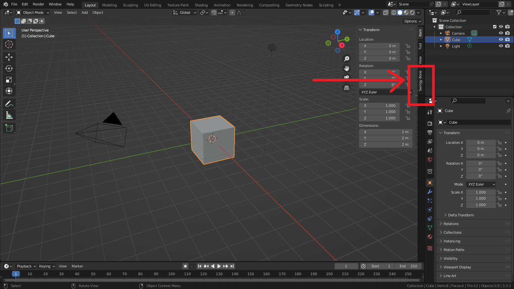

## Requirements

* Windows, MacOS, Linux
* Blender 3.0+

## Installation

* Launch Blender, then go to "Edit" > "Preferences"
* Switch to the Add-ons tab and click the "Install..." button at the top-right
* Locate your SwingyBoneAddon.zip file and double click it.
* Activate the addon by ticking the checkbox
* Make sure that your preferences are saved (they should be by default)
* Close the Preferences panel

If everything worked you should now be able to see a "Swingy Bone" tab in the 3D View's sidebar (press the N key to bring up the latter).

## Update

* Launch Blender, then go to "Edit" > "Preferences"
* Switch to the Add-ons tab and click the "Install..." button at the top-right
* Locate your SwingyBoneAddon.zip file and double click it.
* Activate the addon by ticking the checkbox
* Make sure that your preferences are saved (they should be by default)
* Close the Preferences panel

If everything worked you should now be able to see a "Swingy Bone" tab in the 3D View's sidebar (press the N key to bring up the latter).

<figure markdown>
  { width="800" }
</figure>
