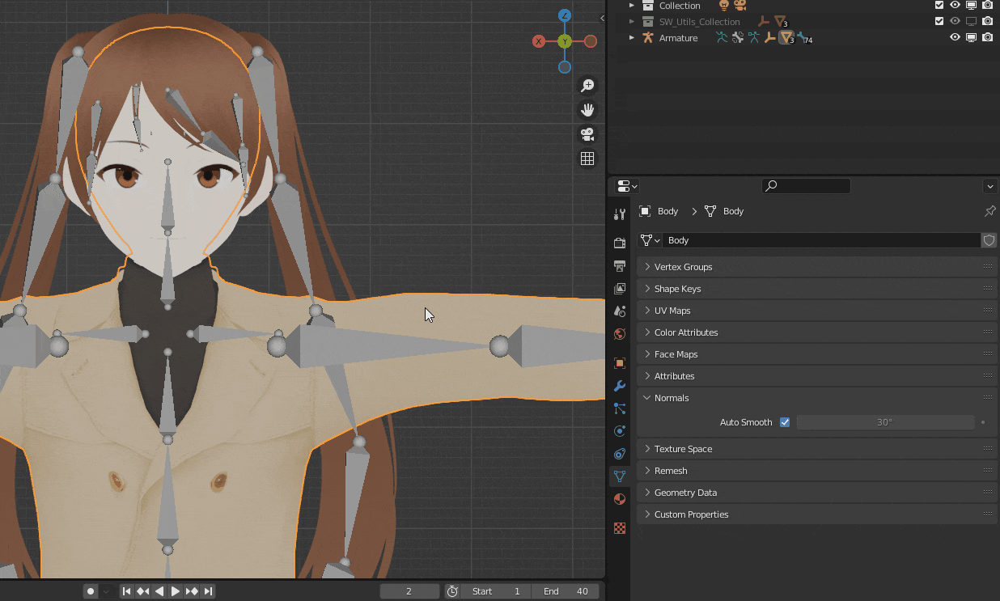

After you created some bone chains, the simulation will happen automatically when the viewport playback is enabled, no further action is needed.

<video width="800" height="480" controls>
  <source src="../Resources/Vids/vid1.mp4" type="video/mp4">
</video>

!!! info

    **Scrubbing the animation timeline manually won't trigger the simulation. This is intended behaviour.**

!!! info

    **The gravity vector used by the simulation is the one defined in the scene settings.**

    <figure markdown>
      
    </figure>

## Performance tips

When working with complex models, the extra simulation computation may make the viewport less responsive. The following tips can be used to improve the playback FPS.

### Disable autosmooth

Disabling autosmooth for the meshes can have a notable impact on the performance. You can find it under "Object Data Properties -> Normals -> Autosmooth". You can disable it for several meshes at once by selecting them then disabling it for the active mesh while holding the ALT key.

<figure markdown>
  { width="800" }
</figure>

### Disable meshes

Hiding meshes you don't need (with the H key or the eye icon in the outliner) doesn't stop Blender from taking them into account when animating. What you want instead is disabling them, using the outliner's icons.

<figure markdown>
  { width="800" }
</figure>
